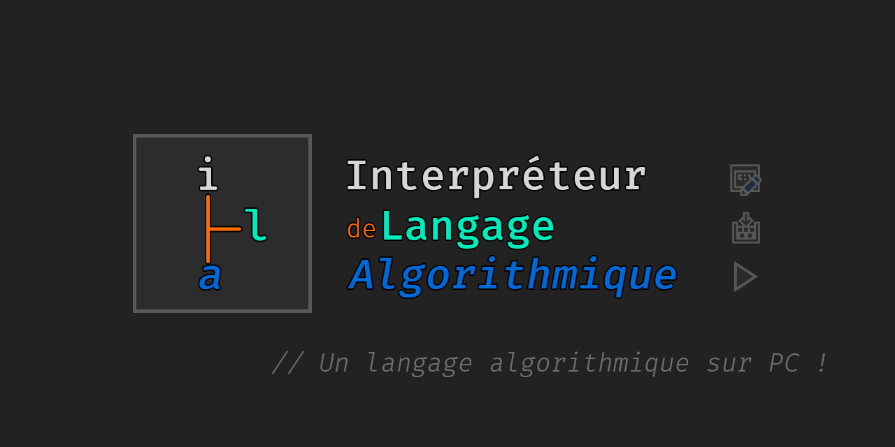

# ILA
> Permet d'écrire un code en ila (langage algo français simpliste) et l'éxecute


<a href="https://forthebadge.com/"></a>


<!---->

One to two paragraph statement about your product and what it does.


## Exemple d'utilisation

Prenons le fichier `helloWorld.ila` suivant :

```
algo Test
{
    ecrire("Hello World")
}
```

Pour l’exécuter il suffit de taper dans la commande :


*(Un gif ici ça pourrait être fun)*

_Pour plus d'exemples, référez vous au [Wiki](https://github.com/oxypomme/ILA/wiki)._

## Setup du développement

Pour générer du code ILA ou le charger, ILA.NET est la bibliothèque qu'il faut utiliser. Simplement écrire ce code permet de charger le programme ila :
```csharp
    var ilaProgram = ILANET.Parser.Parser.Parse(fileContent);
```

## Historique des Release

Aucune Release pour l'instant, projet en développement.

## Meta

Tom SUBLET – [@OxyTom](https://twitter.com/OxyT0m8) – [oxypomme](https://github.com/oxypomme)

Nathan HANEN - [WildGoat07](https://github.com/WildGoat07)

Ce projet est sous la license MIT. Regardez [``LICENSE``](https://github.com/oxypomme/ILA/blob/master/LICENSE) pour plus d'informations.

## Contributing

1. Fork it (<https://github.com/oxypomme/ILA/fork>)
2. Create your feature branch (`git checkout -b feature/fooBar`)
3. Commit your changes (`git commit -am 'Add some fooBar'`)
4. Push to the branch (`git push origin feature/fooBar`)
5. Create a new Pull Request
