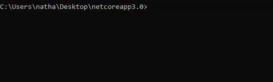

# ILA
> Permet d'écrire un code en ila (langage algo français simpliste) et l'éxecute


<a href="https://forthebadge.com/"></a>


<!---->

One to two paragraph statement about your product and what it does.


## Exemple d'utilisation

Prenons le fichier `test.ila` suivant :

```
algo hello_world
{
    ecrire("Hello World")
}
```

Pour l’exécuter il suffit de taper dans la commande :



_Pour plus d'exemples, référez vous au [Wiki](https://github.com/oxypomme/ILA/wiki)._

## Setup du développement

Pour générer du code ILA ou le charger, ILA.NET est la bibliothèque qu'il faut utiliser. Simplement écrire ce code permet de charger le programme ila :
```csharp
    var ilaProgram = ILANET.Parser.Parser.Parse(fileContent);
```

## Historique des Release

Aucune Release pour l'instant, projet en développement.

## Meta

Tom SUBLET – [@OxyTom](https://twitter.com/OxyT0m8) – [oxypomme](https://github.com/oxypomme)

Nathan HANEN - [WildGoat07](https://github.com/WildGoat07)

[](https://github.com/oxypomme/ILA/blob/master/LICENSE)

## Contributing

1. Fork it (<https://github.com/oxypomme/ILA/fork>)
2. Create your feature branch (`git checkout -b feature/fooBar`)
3. Commit your changes (`git commit -am 'Add some fooBar'`)
4. Push to the branch (`git push origin feature/fooBar`)
5. Create a new Pull Request

## Bug Report

Avant de poster le moindre bug report, merci de respecter ces quelques règles :

> Le formatage des problèmes (Issues) est le suivant :
> - :question: en cas de suggestion
> - :warning: en cas de problème qui n'est pas critique
> - :red_circle: en cas de problème critique
> - Mettre le label correspondant : `bug`, `invalid` ou `suggest`
> - Une description du problème est requise
> - *Si possible, une image du problème (un gif est encore plus explicit)*
